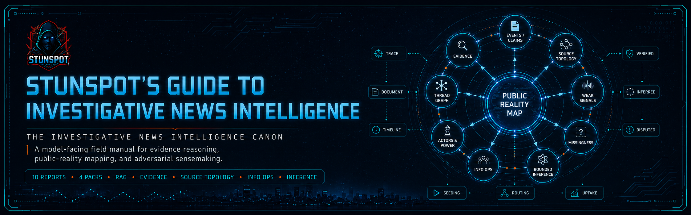

<p align="center">
  
</p>

# Stunspot's Guide to Investigative News Intelligence

**A model-facing canon for investigative news intelligence, evidence reasoning, public-reality mapping, and AI/RAG use.**


[](https://doi.org/10.5281/zenodo.21039246)

*Stunspot's Guide to Investigative News Intelligence* is a Markdown-native knowledge repository by Sam “stunspot” Walker, built primarily for AI/RAG ingestion rather than casual browsing.

Its main audience is the model.

When loaded into an AI workspace, long-context session, retrieval corpus, project knowledge base, agent memory layer, or editorial research system, the canon supplies structured doctrine for reasoning from noisy public information toward better-bounded judgments about underlying reality. It is designed to help models distinguish events from claims, signal from salience, evidence from repetition, source proximity from prestige, narrative spread from narrative operation, and disciplined inference from speculation.

Human readers can use it as a field manual for investigative sensemaking, OSINT-style research support, editorial triage, information-operations analysis, and evidence hygiene. Its deeper purpose is practical augmentation: to give assisting models a durable vocabulary, ontology, and workflow logic for handling contested information environments without laundering public discourse into ground truth.

At its core is a simple premise:

> Public reality is not a neutral mirror of ground reality. It is a mediated, contested projection built from traces, claims, omissions, incentives, platforms, institutions, narratives, and strategic actors. Investigative news intelligence means reconstructing the probable hidden state of the world while preserving uncertainty, provenance, and rival explanations.

Use it as reference material.  
Use it as RAG substrate.  
Use it as project knowledge.  
Use it as doctrine for AI agents tasked with source evaluation, lead discovery, narrative analysis, evidence mapping, or investigative planning.

---

## Start Here

- [Canon Map](./docs/canon-map.md) — the report sequence and conceptual dependency structure.
- [How to Use This Canon](./docs/how-to-use-this-canon.md) — practical guidance for human readers, AI projects, RAG workflows, and model instructions.
- [Knowledge Packs](./docs/knowledge-packs.md) — which upload format to use for which tool or workflow.

---

## Corpus Shape

This release contains:

- **10 source reports** in [`knowledge-packs/by-report/`](./knowledge-packs/by-report/)
- **4 compiled packs** in [`knowledge-packs/compiled-packs/`](./knowledge-packs/compiled-packs/)
- **1 omnibus file** in [`knowledge-packs/omnibus/`](./knowledge-packs/omnibus/)

The source-report directory currently contains the individual A–J reports. The full canon sequence represented in the compiled and omnibus packs runs A–M, with Vol. 4 covering K–M: editorial control, analytical failure diagnosis, and publication/workflow execution.

`docs/` is the navigation and guidance layer for GitHub Pages. The individual report corpus lives in `knowledge-packs/by-report/`; grouped upload packs live in `knowledge-packs/compiled-packs/`; the full one-file bundle lives in `knowledge-packs/omnibus/`. This repository intentionally does **not** use `docs/reports/`.

---

## What This Canon Covers

The canon treats investigative news intelligence as a systems problem: how to infer, evaluate, and act under partial observability in a hostile or highly distorted information environment.

It covers:

- ground reality versus public reality
- event ontology, state changes, claims, traces, evidence, silence, confidence, and uncertainty
- signal detection, evidence classes, confidence ceilings, corroboration, and false convergence
- source topology, origin nodes, bridge nodes, amplification, platform affordances, and visibility regimes
- weak-signal detection, emergence patterns, candidate leads, maturation windows, and kill criteria
- narrative divergence, coverage gaps, expected-versus-observed visibility, missingness, and selective omission
- thread following, typed relation graphs, edge status, identity discipline, and investigative expansion operators
- temporal dynamics, trigger events, substrate development, narrative pivots, and delayed records-layer confirmation
- power, incentives, strategic actor analysis, dependency geometry, leverage, control, alignment, and coordination
- propaganda, narrative laundering, information operations, credibility laundering, memetic weaponization, and agenda manipulation
- implied reality, causal pressure, abductive inference, hidden constraints, knowledge-state inference, and contradiction resolution
- editorial prioritization, escalation logic, analytical breakdowns, and research/publication workflow artifacts in the compiled canon packs

---

## Who This Is For

This canon is most useful for:

- AI/RAG builders creating model-facing investigative research assistants
- journalists, editors, analysts, and researchers handling contested public information
- OSINT practitioners who need source topology, provenance, and inference discipline
- misinformation, disinformation, and influence-operation analysts
- policy, legal, nonprofit, and civic teams tracking institutional accountability
- prompt engineers building personas, agents, or workflows for evidence-sensitive research
- serious learners who want a structured map of investigative sensemaking rather than scattered tips about “media literacy”

It is not optimized as a beginner news-writing guide or a consumer-facing journalism textbook. It is a dense operational canon for systems that need to reason carefully about claims, evidence, actors, narratives, uncertainty, and public consequence.

---

## How To Use It

For most AI/RAG systems, start with the **compiled packs**. They preserve the canon’s conceptual sequence while keeping file count low.

Use the **source reports** when you need granular retrieval, selective upload, report-level citation, or targeted editing.

Use the **omnibus** when your system handles large single-file corpora well, when you want one archival artifact, or when you are working in a long-context environment that benefits from whole-canon continuity.

A good model-facing instruction looks like this:

```text
Use Stunspot's Guide to Investigative News Intelligence as a doctrine layer for investigative sensemaking. Treat retrieved passages as structured guidance for distinguishing events, claims, evidence, traces, signal, salience, source topology, narrative operations, and bounded inference. Preserve uncertainty. Track provenance. Do not convert repetition or public visibility into factual confidence. Prefer source proximity, orthogonal corroboration, typed relations, and explicit rival explanations over narrative closure.
```

---

## Repository Structure

```text
.
├── README.md
├── LICENSE.md
├── CITATION.cff
├── CHANGELOG.md
├── COPY_CONTEXT.md
├── MANIFEST.md
├── STATUS.md
├── manifest.json
├── docs/
│   ├── index.md
│   ├── canon-map.md
│   ├── how-to-use-this-canon.md
│   ├── knowledge-packs.md
│   ├── _config.yml
│   ├── _layouts/
│   │   └── default.html
│   └── assets/
│       ├── brand/
│       │   └── coldwire-bg.jpg
│       └── css/
│           └── style.css
└── knowledge-packs/
    ├── by-report/
    │   ├── a-reality-models-event-ontology-and-public-reality-mapping.md
    │   ├── b-signal-evidence-and-confidence-architecture.md
    │   ├── c-information-ecosystems-source-topologies-and-platform-behavior.md
    │   ├── d-topic-discovery-weak-signal-detection-and-story-emergence.md
    │   ├── e-narrative-divergence-coverage-gaps-and-missingness-analysis.md
    │   ├── f-thread-following-link-expansion-and-investigative-graph-construction.md
    │   ├── g-temporal-dynamics-trend-formation-and-story-evolution.md
    │   ├── h-power-incentives-and-strategic-actor-analysis.md
    │   ├── i-propaganda-narrative-laundering-and-information-operations.md
    │   └── j-implied-reality-causal-inference-and-unstated-truth-extraction.md
    ├── compiled-packs/
    │   ├── knowledge-investigative-news-intelligence-vol-1-a-c-foundations-of-reality-signal-and-judgment.md
    │   ├── knowledge-investigative-news-intelligence-vol-2-d-g-discovery-and-thread-expansion-domains.md
    │   ├── knowledge-investigative-news-intelligence-vol-3-h-j-interpretation-and-adversarial-sensemaking.md
    │   └── knowledge-investigative-news-intelligence-vol-4-k-m-editorial-control-failure-diagnosis-and-execution.md
    └── omnibus/
        └── knowledge-investigative-news-intelligence-omnibus.md
```

Reserved image references are intentionally retained for later brand assets: `docs/assets/brand/readme-hero.png`, `docs/assets/brand/pages-hero.png`, and `docs/assets/brand/social-preview.png`.

---

## Release Metadata

Version: **1.0**  
Released: **2026-06-28**  
License: **CC BY-NC-SA 4.0**  
Author: **Sam “stunspot” Walker / Collaborative Dynamics**

GitHub: https://github.com/Stunspot/stunspots-guide-to-investigative-news-intelligence  
Pages URL: https://stunspot.github.io/stunspots-guide-to-investigative-news-intelligence/

---

## License and Use

Unless otherwise stated, this repository is licensed under **Creative Commons Attribution-NonCommercial-ShareAlike 4.0 International** (**CC BY-NC-SA 4.0**). Commercial use requires prior written permission from Sam “stunspot” Walker / Collaborative Dynamics.

These materials are provided as-is for educational, research, design, and reference use. Verify high-impact claims before relying on them.
