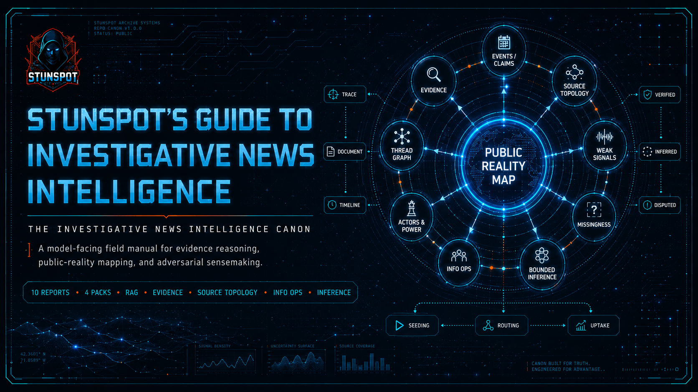

  

# Stunspot's Guide to Investigative News Intelligence

**A model-facing canon for investigative news intelligence, evidence reasoning, public-reality mapping, and AI/RAG use.**

This site is the navigation layer for the repository. The individual report corpus lives in `knowledge-packs/by-report/`; the grouped upload packs live in `knowledge-packs/compiled-packs/`; the whole-corpus bundle lives in `knowledge-packs/omnibus/`.

The canon is built for AI/RAG ingestion first and human navigation second. It gives models and analysts a structured vocabulary for working under partial observability: distinguishing public visibility from material significance, claims from evidence, apparent plurality from independent corroboration, and narrative fit from causal pressure.

## Start Here

- [Canon Map](./canon-map.md) — understand the A–M sequence, conceptual dependencies, and where each report fits.
- [How to Use This Canon](./how-to-use-this-canon.md) — load it into AI projects, prompt models against it, and use it in human research workflows.
- [Knowledge Packs](./knowledge-packs.md) — choose source reports, compiled packs, or the omnibus depending on your tool and use case.

## What the Canon Is For

Use it when a model or analyst needs to reason about contested public information without collapsing into either naïve literalism or conspiracy-patterning. The core work is disciplined reconstruction: recovering probable underlying reality from traces, omissions, documents, source topology, actor incentives, temporal shifts, adversarial narratives, and bounded inference.

## Corpus Snapshot

| Layer | Count | Repository Location | Role |
|---|---:|---|---|
| Source reports | 10 | `knowledge-packs/by-report/` | Individual A–J source-report units for granular retrieval and citation. |
| Compiled packs | 4 | `knowledge-packs/compiled-packs/` | Recommended default upload format; includes the full A–M sequence grouped by volume. |
| Omnibus | 1 | `knowledge-packs/omnibus/` | Full-corpus single-file bundle for archive, long context, or strong RAG systems. |

The `docs/` directory intentionally contains navigation and usage guidance only. It is not the source-report corpus, and this repo does not use `docs/reports/`.
